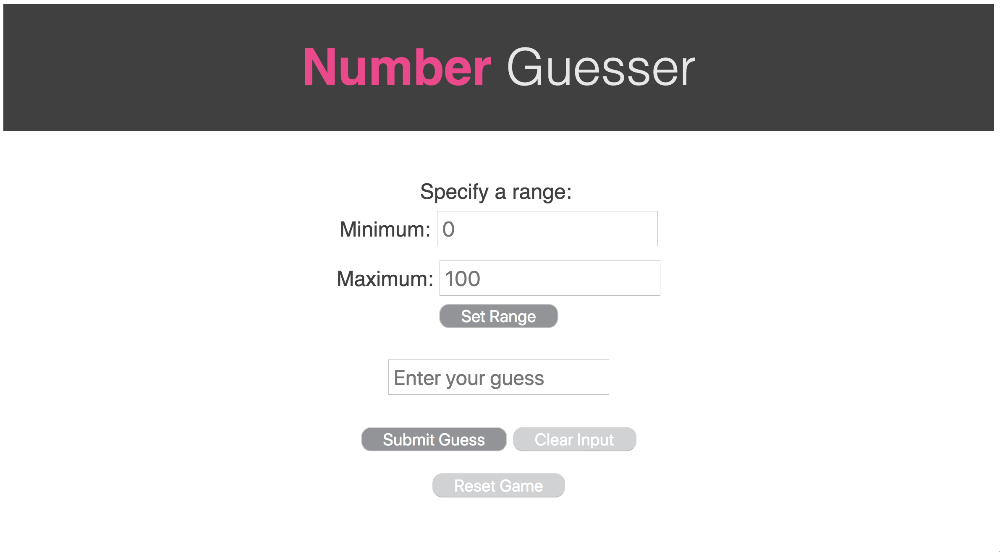
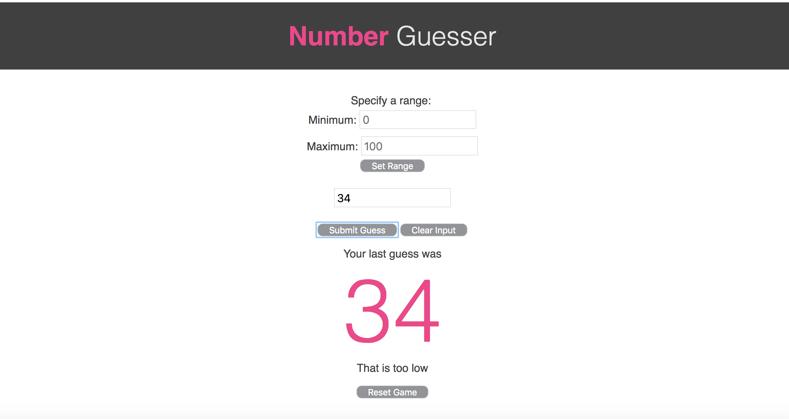
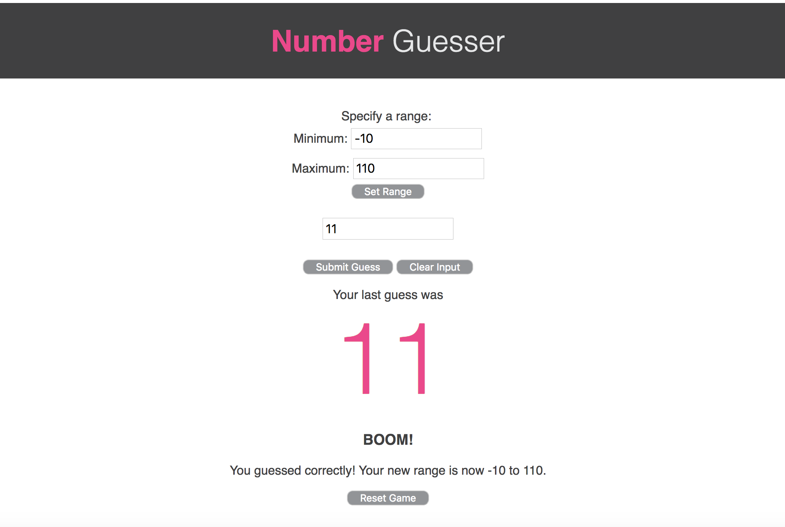

# Number Guesser

This is a number guessing game where users can try to guess a randomly generated number.  As the user guesses, they will receive feedback as to whether the answer is higher, lower, or if they guessed correctly!  The initial range of numbers is set for 0 - 100, but users can specify their own range.  When a user correctly guesses the right answer, the range will increase by 20 (10 lower then the lowest number in the range, and 10 higher than the largest number in the range).  Happy guessing!

## Getting Started

These instructions will get you a copy of the project up and running on your local machine for development and testing purposes.

From GitHub clone down repository using the following commands in terminal:
* `git clone git@github.com:jplao/number_guesser.git`
* `cd number_guesser`

You can try it yourself by opening the file using your finder or by visiting [here](https://jplao.github.io/number_guesser/)

## Using the App

When first visiting the app, the page will look like this:

A user can adjust the range for the randomly generated answer by inputting new numbers in the minimum or maximum input boxes and clicking on "Set Range".

A user can submit a guess by entering a guess in the input field and clicking on "Submit Guess". After each guess is submitted, the screen will display the number the user guessed as well as feedback to help the user find the correct answer.  An error message will be displayed if the user guesses a number outside of the set range or if they do not enter a valid number.  Here is an example of the feedback given after a low guess:

Once a user correctly guesses the answer, a win message will be displayed.  The range will be increased and a new number will be generated.

Once any guess is made, a user will have the option to "Clear Input" which removes the guessed number from the input field.  They can also "Reset Game", which returns the initial range to 0-100, clears the page of all feedback, and generates a new number to guess.

## Built With

* HTML
* CSS
* Javascript

## Author

* Jennifer Lao - Github: [jplao](https://www.github.com/jplao)
